# German Credit Risk Analysis and Classification

## Overview
This report provides an extensive exploratory data analysis (EDA) and classification model development conducted on the German Credit dataset, sourced from the UCI Machine Learning Repository. The aim of the project was to thoroughly analyze dataset features, visualize insights, and construct predictive models capable of classifying applicants into distinct categories of credit risk (Good Risk vs. Bad Risk).

## Table of Contents

### 📊 Data Preparation and Exploratory Analysis
1. Setup & Imports
2. Load Data & Rename Columns
3. Descriptive Statistics
4. Class Balance
5. Numerical Distributions by Risk
6. Categorical Distributions by Risk
7. Correlation Heatmap
8. Normality Check (Q–Q Plots)
9. Boxplot: Loan Amount by Risk

### 🤖 Model Training, Evaluation, and Reporting
10. Train/Test Split
11. Feature Scaling
12. PCA Analysis
13. Addressing Class Imbalance
14. Classification Models <br>
&emsp;&emsp;• 14.1 Helper Functions  <br>
&emsp;&emsp;• 14.2 Train & Cross‑Validate  <br>
15. Performance Visualization
16. Exporting Results for Reporting <br>
&emsp;&emsp;• 16.1 Feature Importances (Random Forest)  <br>
&emsp;&emsp;• 16.2 Model Summary Table
17. Next Steps
## Dataset Description
The German Credit dataset contains 1,000 loan application records. Each record is characterized by various numeric, categorical, ordinal, and encoded features related to the applicant’s financial status, personal information, loan purpose, and more. The main classification target is the applicant’s credit risk:

- **Good Credit Risk (Class 1)** – approximately 70% of the dataset
- **Bad Credit Risk (Class 2)** – approximately 30% of the dataset

For more details, refer to the dataset source: [UCI German Credit Data](https://archive.ics.uci.edu/ml/datasets/Statlog+(German+Credit+Data)).

## 🔄 Data Extraction and Preparation Pipeline

To modularize and automate the transformation of the raw credit dataset, a lightweight ETL pipeline has been implemented using Python and SQL.

- **Extract**: Data is read from a local SQLite database (`data/german_credit.db`).
- **Transform**: Feature engineering is applied using a SQL view defined in [`sql/feature_engineering.sql`](sql/feature_engineering.sql), which decodes categorical codes and creates interpretable features.
- **Load**: The transformed dataset is exported to a CSV file (`data/processed/credit_features.csv`) for downstream analysis.

This process is encapsulated in the script [`etl/run_etl_pipeline.py`](etl/run_etl_pipeline.py), enabling consistent preprocessing and reproducibility across environments.

Run the pipeline with:
```bash
python etl/run_etl_pipeline.py
```

---

## 🧼 Additional Cleaning and Encoding

After generating the processed dataset via the ETL pipeline, additional preparation steps were applied to optimize the data for modeling:

- **Missing categorical values** were imputed with a default `"Unknown"` label to retain completeness without loss.
- The column `Personal Status & Sex` was **binary encoded** to extract a simplified `Sex` feature.
- The target label `Risk Label` was remapped to a new column `Target`, where:
  - `1` represents **Good Credit Risk**
  - `0` represents **Bad Credit Risk**

The final modeling dataset contains **98 features**:
- **21 original features**
- **77 derived features** generated through one-hot encoding and engineered variables.

Below is a snapshot of the raw dataset prior to transformation:

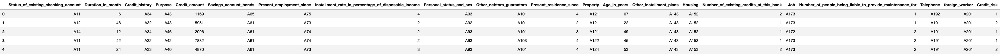
---
## Exploratory Data Analysis (EDA)

The exploratory phase involved detailed statistical analysis and visualization:

### Data Overview
To gain a quick overview of the dataset, we computed descriptive statistics for the numerical features. Since the dataset has already been one-hot encoded, this summary focuses only on continuous variables. A few redundant or uninformative columns were excluded to streamline the analysis.

The table below displays key statistics such as the mean, standard deviation, minimum, and maximum values for each numerical feature. To improve readability, the summary is styled with a blue gradient and exported as an image for easy reference.

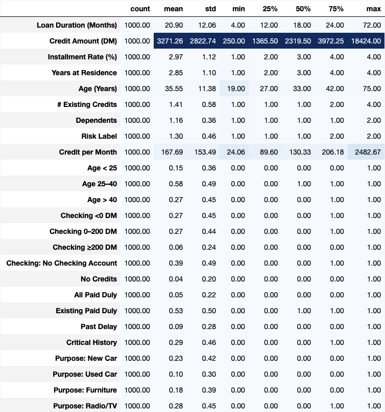

### Class Balance Analysis
A significant imbalance was observed, with good credit risks constituting 70% of cases. This imbalance can bias predictive models toward the majority class. The imbalance was visualized using both count and pie charts:

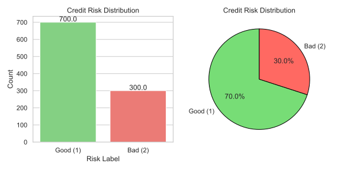

### Numerical Distribution by Risk
Descriptive statistics for numerical features such as Credit Amount, Loan Duration, and Age revealed skewed distributions, especially notable in the Credit Amount and Loan Duration features. Density plots helped visualize differences between Good and Bad risk classes, showing that higher loan amounts and longer durations tended to correlate more strongly with bad credit risks.

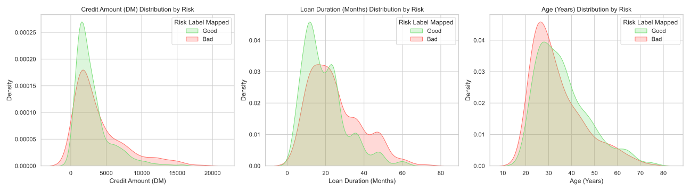

Boxplots further clarified that Bad Risk loans were typically higher in amount and longer in duration:

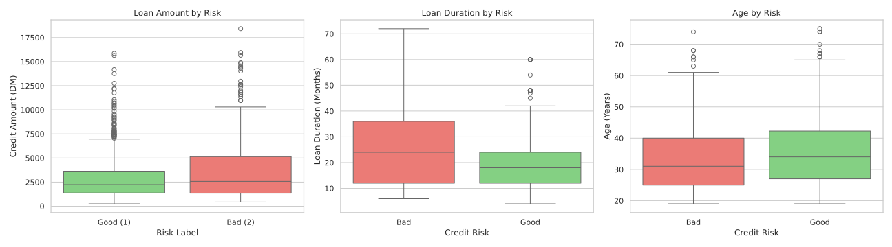

### Categorical Feature Analysis
The analysis of categorical features such as Loan Purpose, Housing Type, and Personal Status & Sex highlighted key trends. For instance, people with rented housing or those seeking loans for used cars and retraining exhibited higher proportions of bad credit risk:

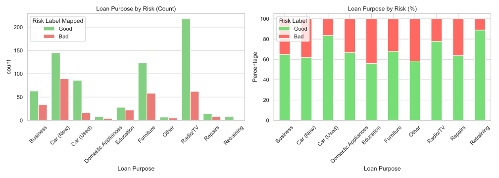
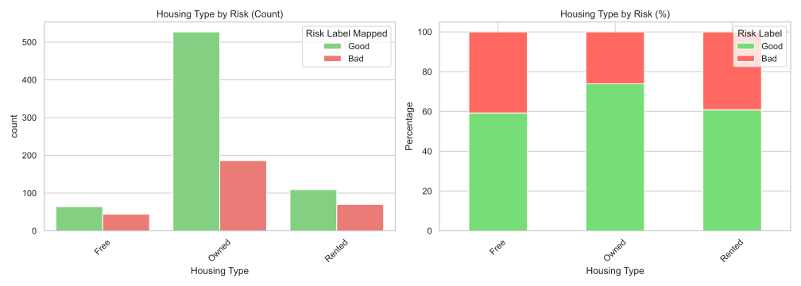
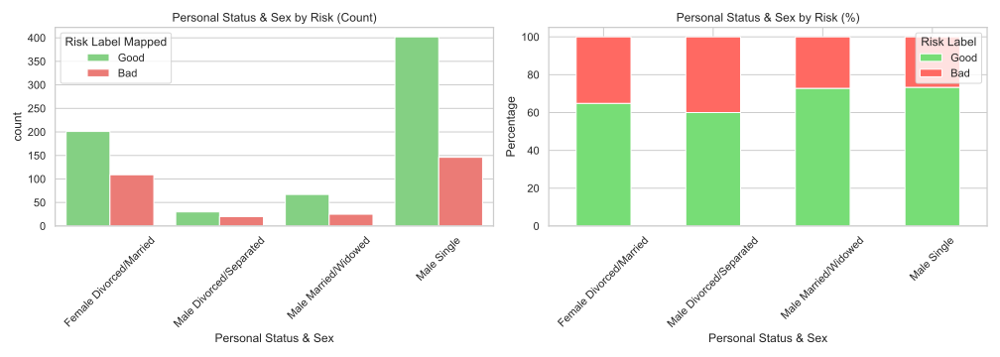

### Correlation Analysis
A correlation heatmap showed moderate internal correlations within grouped features (one-hot encoded categories) but relatively weak correlations across different feature groups, indicating minimal multicollinearity.

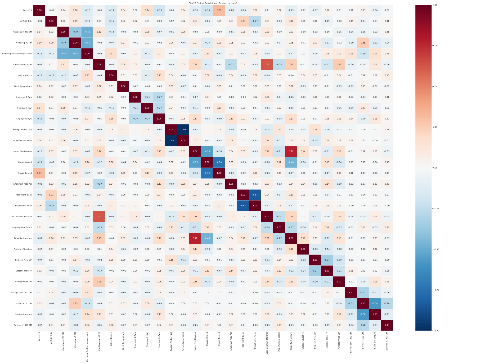

### Normality Checks (Q-Q Plots)
Quantile-Quantile plots indicated significant deviations from normality in numerical features, particularly evident in the distribution tails of Credit Amount:

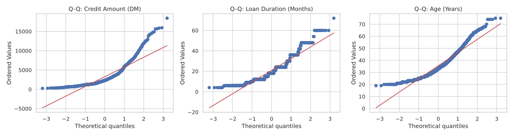

## Model Development

### Train-Test Split and Feature Scaling
The dataset was split into training (80%) and test sets (20%) using stratified sampling to preserve class distribution. Feature scaling was performed using both standardization and min-max scaling techniques to ensure effective model training.

### Dimensionality Reduction (PCA)
Principal Component Analysis (PCA) was applied to reduce feature dimensionality, capturing 95% of variance in fewer components. PCA effectively visualized class separations in a 2-dimensional space:

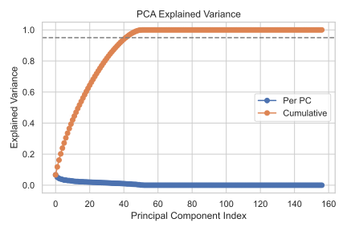
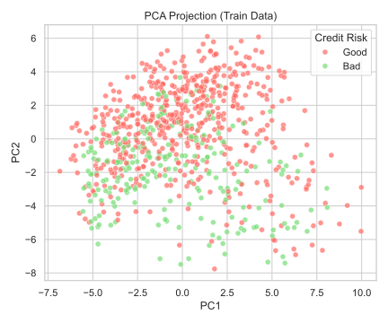

### Addressing Class Imbalance
To handle class imbalance, various resampling techniques such as Cluster Centroids (undersampling), SMOTE, and KMeans-SMOTE (oversampling) were employed, as shown in the comparative visualization below:

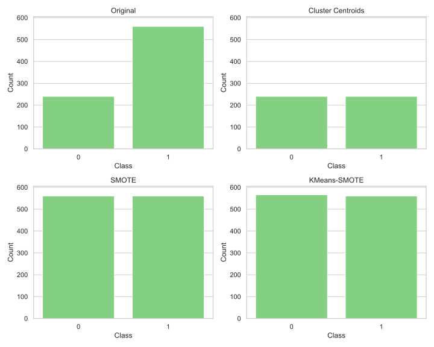

## Classification Models and Evaluation

Three classification models—Logistic Regression, Random Forest, and Support Vector Machine (SVM)—were trained and evaluated using 5-fold cross-validation optimized for the F1 score.

### Model Performance
Random Forest emerged as the best-performing model, exhibiting the highest F1 score, precision, recall, and area under the Precision-Recall curve (PR-AUC). Performance across models is summarized:

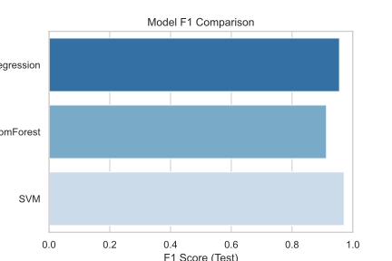

Confusion matrices and precision-recall curves further provided detailed insights into model performances:

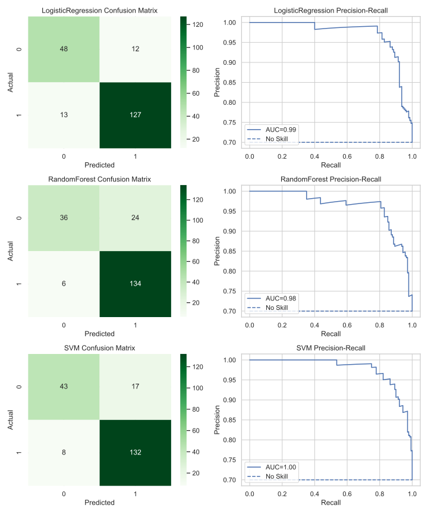

## Conclusions
Random Forest demonstrated superior predictive capability, leveraging key features such as Checking Account Status, Loan Duration, and Credit History. Addressing class imbalance significantly enhanced model effectiveness, highlighting the critical role of proper data preprocessing.

## Recommendations and Future Work
Future improvements could involve additional feature engineering, advanced hyperparameter tuning, and exploring ensemble methods like Gradient Boosting Machines (GBM). Additionally, addressing outliers and applying transformations to skewed data might further improve model performance and stability.

## Project Structure
```
.
├── data
│   ├── raw
│   │   └── german_credit.csv
│   │   └── model_summary.csv
│   │   └── rf_feature_importances.csv
│   └── processed
│       └── credit_features.csv
│   └── col_mapping.json
│   └── german_credit.db
├── sql
│   └── feature_engineering.sql
├── databricks
│   └── german_credit_databricks.py
├── plots
│   ├── credit_eda.svg
│   ├── numerical_distribution.svg
│   ├── box_plots.svg
│   ├── categorical_distribution_Loan Purpose.svg
│   ├── categorical_distribution_Housing Type.svg
│   ├── categorical_distribution_Personal_Status_&_Sex.svg
│   ├── corrlation_heatmaps.svg
│   ├── qq_plots.svg
│   ├── pca_explained_variance.svg
│   ├── pca_explained_variance_2d.svg
│   ├── kmeans-smote.svg
│   ├── f1-score.svg
│   └── precision-recall.svg
└── credit_eda.ipynb
└── README.md
└── requirements.txt

```
## 💻 Databricks Integration

A version of this notebook was ported to [Databricks](https://www.databricks.com/) for scalable development, exploration, and experimentation.  
It is available as a Python script in the [`databricks/`](databricks/) directory:

- [`german_credit_databricks.py`](databricks/german_credit_databricks.py): A Databricks-compatible version of the full analysis pipeline, structured with `# COMMAND ----------` cells for direct execution.

This version enables:
- Direct use of Spark and Delta Lake for scalable data loading and persistence
- Integration with MLflow tracking (if enabled in your workspace)
- Seamless experimentation with parameter widgets and notebooks


This detailed report combines robust statistical analysis and visual insights to provide comprehensive understanding and actionable recommendations for credit risk assessment.

## License

This project is licensed under the Creative Commons Attribution-NonCommercial-NoDerivatives 4.0 International License.  
You may not reuse, remix, or redistribute any part of this project for commercial or derivative purposes.

Read the full license [here](https://creativecommons.org/licenses/by-nc-nd/4.0/).